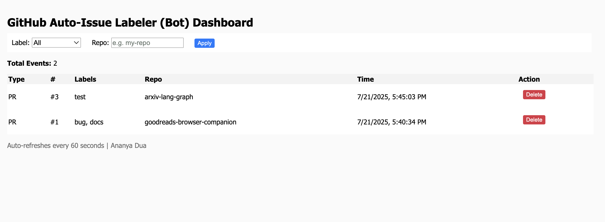
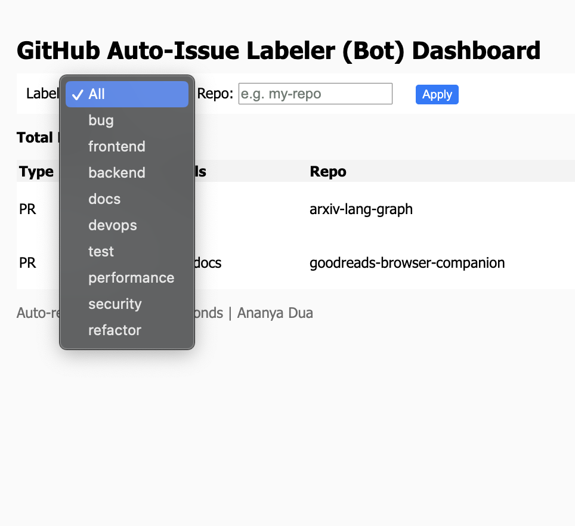

# GitHub Auto-Issue Labeler Bot + Dashboard

A GitHub bot that automatically labels **Issues** and **Pull Requests** using a rule-based engine and ML-powered classification. Includes a web dashboard to visualize and filter all contributor activity.

> Built with TypeScript, Express, MongoDB, and EJS. Supports Dockerized deployments, GitHub Actions for CI/CD, and plug-and-play ML classifiers like BART, DistilBERT, or any HuggingFace-supported model.

---

## Motivation

Maintainers waste valuable time triaging unlabeled issues. This project solves that with automated, intelligent labeling, ensuring faster prioritization, contributor clarity, and repo hygiene. It’s fully modular and extendable for any team or workflow.

---

## Inspiration

- [`Probot`](https://probot.github.io/)
- GitHub's built-in auto-labeling (limited)

---
## Features

- Auto-label GitHub Issues & PRs via rule-based NLP or ML inference
- Real-time GitHub webhook listener for issues and pull_request
- Dashboard with filters (label/repo), live-refresh, and latest-first sort
- ML service powered by HuggingFace Transformers (zero-shot)
- MongoDB persistence for activity logs (LabelEvents)
- Extensible keyword-label rules per org/project
- Docker Compose-based local development and deployment
- Webhook signature verification and .env config support
---

## Architecture

```text
+------------------+       +-------------------+       +-----------------------+
|  GitHub Webhook  +------>+  Express Webhook  +------>+  Label Engine         |
|  Events (PRs)    |       |  Listener (Node)  |       |  (Keyword + ML)       |
+------------------+       +-------------------+       +----------+------------+
                                                                    |
                                                                    v
                                                      +---------------------------+
                                                      |  MongoDB (Activity Logs)  |
                                                      +------------+--------------+
                                                                   |
                                                                   v
                                                      +---------------------------+
                                                      |     Dashboard (EJS)       |
                                                      +---------------------------+
                                                      
```
## Tech Stack

| Layer         | Tech Stack                                      |
|---------------|--------------------------------------------------|
| **Backend**   | Node.js, Express, TypeScript                    |
| **Database**  | MongoDB Atlas (via Mongoose)                    |
| **Frontend**  | EJS, HTML, Vanilla CSS                          |
| **Webhook**   | GitHub Webhooks (`issues`, `pull_request`)      |
| **ML**| Python, Huggingface Transformers (DistilBERT)           |
| **Dev Tools** | ts-node-dev, dotenv, ngrok                      |
| **Dev Ops** | Docker, Docker Compose, GitHub Actions (CI/CD)    |
| **Future**    | Docker, GitHub Actions CI/CD                    |

---

## Getting Started

### 1. Clone the repository

```bash
git clone https://github.com/ananyadua27/GitHub-issue-labeler-bot.git
cd GitHub-issue-labeler-bot
```

### 2. Configure environment
Create a .env.docker file in the root:

```bash
GITHUB_TOKEN=
MONGO_DB_URL=
PORT=3000
```

### 3. Run with Docker Compose
```bash
docker compose --env-file .env.docker up --build
```

## GitHub Webhook Setup

1. Go to your repository on GitHub
2. Navigate to **Settings → Webhooks**
3. Click **“Add webhook”**
4. Fill out the webhook form:
   - **Payload URL**: `https://<your-ngrok-or-deployed-url>/webhook`
   - **Content type**: `application/json`
   - **Events**: Choose:
     - Individual events →  _Issues_ and _Pull Requests_
5. Click **Add webhook**

Once configured, the bot will listen for:
- New issues
- New pull requests
- Edits to either

---

## Dashboard

> Deployable via Vercel, Railway, or your own Node server.

### Features:
-  **Auto-refreshing** table (every 60 seconds)
-  **Filter by label** (`bug`, `frontend`, `backend`, `docs`)
-  **Filter by repo name** (e.g., `my-repo`)
-  **Sorted by latest first**

### Demo:



---

## Smart Labeling Engine

### Rule-Based Matching

Defined in `labeler.ts` using keyword triggers:

| Label        | Trigger Keywords (Examples)                                     |
|--------------|-----------------------------------------------------------------|
| `bug`        | `error`, `fail`, `crash`, `timeout`, `broken`, `issue`         |
| `frontend`   | `.tsx`, `React`, `CSS`, `UI`, `layout`, `component`, `style`   |
| `backend`    | `api`, `server`, `auth`, `controller`, `express`, `mongoose`   |
| `docs`       | `README`, `.md`, `wiki`, `guide`, `documentation`              |
| `devops`     | `docker`, `CI`, `CD`, `workflow`, `pipeline`, `kubernetes`     |
| `test`       | `unit test`, `jest`, `cypress`, `mock`, `assert`, `coverage`   |
| `performance`| `optimize`, `latency`, `slow`, `profiling`, `throughput`       |
| `security`   | `xss`, `csrf`, `auth`, `token`, `permission`, `injection`      |
| `refactor`   | `clean`, `rename`, `simplify`, `tidy`, `modularize`            |

> Keywords can be extended easily to customize label logic per repo or team.

---

### ML-Based Classification (Optional)

Optional service powered by **DistilBERT** via Hugging Face Transformers:

- Zero-shot classifier powered by facebook/bart-large-mnli
- Accepts title + body of Issues/PRs as input
- Deployed via Flask and called internally at /predict

---

## Performance & Scalability

- Non-blocking, async webhook handlers via Express
- Efficient MongoDB querying with indexed fields
- ML inference runs asynchronously to avoid blocking webhook thread
- Horizontally scalable via stateless architecture

---

## Security

- GitHub webhook signature verification (HMAC-SHA256) 
- Environment variables stored securely (`.env`, GitHub secrets)
- Rate-limiting middleware (planned for production deployment)

---

## API Endpoints

| Method | Route           | Description                     |
|--------|------------------|---------------------------------|
| `POST` | `/webhook`       | Webhook listener for GitHub     |
| `POST` | `/predict`       | ML service endpoint for label prediction |
| `GET`  | `/dashboard`     | Rendered UI with filters        |
| `GET`  | `/api/activity`  | JSON feed of recent activity    |

---

## Future Improvements 

Caching layer + rate-limiting for ML microservice

## License

MIT License — free to use, extend, and contribute.

